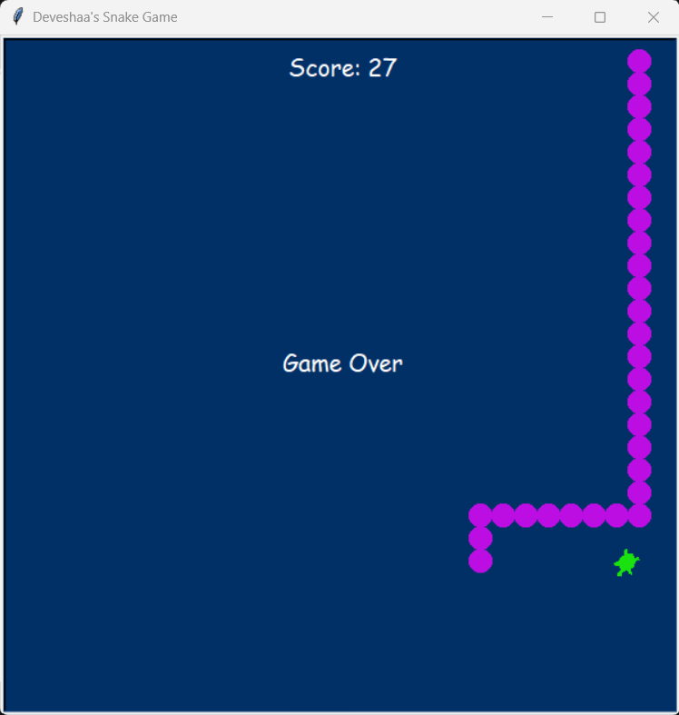

# Python Snake Game
Classic Snake Game built using Python and Turtle Graphics

## Screenshot

## Features
- Snake movement
- Food spawning
- Score tracking
- Snake growth
- Wall collision detection
- Self-collision detection

## Technologies Used
- Python
- Turtle Graphics
  
## Concepts Practiced
- Object-Oriented Programming (OOP)
- Inheritance
- Event-driven programming
- Collision detection
- Modular code organization
